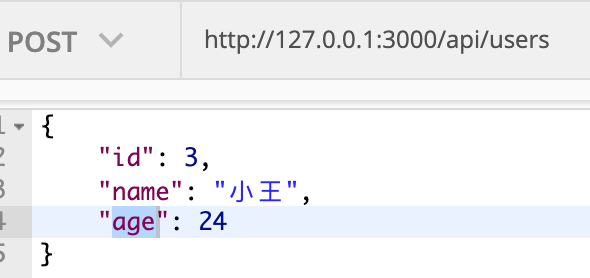
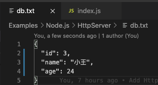

`Node.js`也是`JavaScript`，所以前端开发者应该天生就会一点。一般我们会用它来做`CLI工具`或者`Web服务器`，做`Web服务器`也有很多成熟的框架，比如`Express`和`Koa`。但是`Express`和`Koa`都是对`Node.js`原生`API`的封装，所以其实不借助任何框架，只用原生`API`我们也能写一个`Web服务器`出来。本文要讲的就是不借助框架，只用原生`API`怎么写一个`Web服务器`。因为在我的计划中，后面会讲`Express`和`Koa`的源码解析，他们都是使用原生API来实现的，所以本文其实是这两个源码解析的前置知识。

**本文可运行代码示例已经上传GitHub，大家可以拿下来玩玩：[https://github.com/dennis-jiang/Front-End-Knowledges/tree/master/Examples/Node.js/HttpServer](https://github.com/dennis-jiang/Front-End-Knowledges/tree/master/Examples/Node.js/HttpServer)**

## Hello World

要搭建一个简单的`Web服务器`，使用原生的`http`模块就够了，一个简单的`Hello World`程序几行代码就够了：

```javascript
const http = require('http')

const port = 3000

const server = http.createServer((req, res) => {
  res.statusCode = 200
  res.setHeader('Content-Type', 'text/plain')
  res.end('Hello World')
})

server.listen(port, () => {
  console.log(`Server is running on http://127.0.0.1:${port}/`)
})
```

这个例子就很简单，直接用`http.createServer`创建了一个服务器，这个服务器也没啥逻辑，只是在访问的时候返回`Hello World`。服务器创建后，使用`server.listen`运行在`3000`端口就行。

这个例子确实简单，但是他貌似除了输出一个`Hello World`之外，啥也干不了，离我们一般使用的`Web服务器`还差了很远，主要是差了这几块：

> 1. 不支持`HTTP`动词，比如`GET`，`POST`等
> 2. 不支持路由
> 3. 没有静态资源托管
> 4. 不能持久化数据

前面三点是一个`Web服务器`必备的基础功能，第四点是否需要要看情况，毕竟目前很多`Node`的`Web服务器`只是作为一个中间层，真正跟数据库打交道做持久化的还是各种微服务，但是我们也应该知道持久化怎么做。

所以下面我们来写一个真正能用的`Web服务器`，也就是说把前面缺的几点都补上。

## 处理路由和HTTP动词

前面我们的那个`Hello World`也不是完全不能用，因为代码位置还是得在`http.createServer`里面，我们就在里面添加路由的功能。为了跟后面的静态资源做区分，我们的API请求都以`/api`开头。要做路由匹配也不难，最简单的就是直接用`if`条件判断就行。为了能拿到请求地址，我们需要使用`url`模块来解析传过来的地址。而`Http`动词直接可以用`req.method`拿到。所以`http.createServer`改造如下：

```javascript
const url = require('url');

const server = http.createServer((req, res) => {
  // 获取url的各个部分
  // url.parse可以将req.url解析成一个对象
  // 里面包含有pathname和querystring等
  const urlObject = url.parse(req.url);
  const { pathname } = urlObject;

  // api开头的是API请求
  if (pathname.startsWith('/api')) {
    // 再判断路由
    if (pathname === '/api/users') {
      // 获取HTTP动词
      const method = req.method;
      if (method === 'GET') {
        // 写一个假数据
        const resData = [
          {
            id: 1,
            name: '小明',
            age: 18
          },
          {
            id: 2,
            name: '小红',
            age: 19
          }
        ];
        res.setHeader('Content-Type', 'application/json')
        res.end(JSON.stringify(resData));
        return;
      }
    }
  }
});
```

现在我们访问`/api/users`就可以拿到用户列表了：


## 支持静态文件

上面说了`API`请求是以`/api`开头，也就是说不是以这个开头的可以认为都是静态文件，不同文件有不同的`Content-Type`，我们这个例子里面暂时只支持一种`.jpg`吧。其实就是给我们的`if (pathname.startsWith('/api'))`加一个`else`就行。返回静态文件需要：

> 1. 使用`fs`模块读取文件。
> 2. 返回文件的时候根据不同的文件类型设置不同的`Content-Type`。

所以我们这个`else`就长这个样子：

```javascript
// ... 省略前后代码 ...

else {
  // 使用path模块获取文件后缀名
  const extName = path.extname(pathname);

  if (extName === '.jpg') {
    // 使用fs模块读取文件
    fs.readFile(pathname, (err, data) => {
      res.setHeader('Content-Type', 'image/jpeg');
      res.write(data);
      res.end();
    })
  }
}
```

然后我们在同级目录下放一个图片试一下：


## 数据持久化

数据持久化的方式有好几种，一般都是存数据库，少数情况下也有存文件的。存数据库比较麻烦，还需要创建和连接数据库，我们这里不好`demo`，我们这里演示一个存文件的例子。一般`POST`请求是用来存新数据的，我们在前面的基础上再添加一个`POST /api/users`来新增一条数据，只需要在前面的`if (method === 'GET')`后面加一个`POST`的判断就行：

```javascript
// ... 省略其他代码 ...

else if (method === 'POST') {
  // 注意数据传过来可能有多个chunk
  // 我们需要拼接这些chunk
  let postData = '';
  req.on('data', chunk => {
    postData = postData + chunk;
  })

  req.on('end', () => {
    // 数据传完后往db.txt插入内容
    fs.appendFile(path.join(__dirname, 'db.txt'), postData, () => {
      res.end(postData);  // 数据写完后将数据再次返回
    });
  })
}
```

然后我们测试一下这个`API`:



再去看看文件里面写进去没有：



## 总结

到这里我们就完成了一个具有基本功能的`web服务器`，代码不复杂，但是对于帮我们理解`Node web服务器`的原理很有帮助。但是上述代码还有个很大的问题就是：**代码很丑**！所有代码都写在一堆，而且`HTTP动词`和路由匹配全部是使用`if`条件判断，如果有几百个`API`，再配合十来个动词，那代码简直就是个灾难！所以我们应该将`路由处理`，`HTTP动词`，`静态文件`，`数据持久化`这些功能全部抽离出来，让整个应用变得更优雅，更好扩展。这就是`Express`和`Koa`这些框架存在的意义，下一篇文章我们就去`Express`的源码看看他是怎么解决这个问题的，点个关注不迷路~

**本文可运行代码示例已经上传GitHub，大家可以拿下来玩玩：[https://github.com/dennis-jiang/Front-End-Knowledges/tree/master/Examples/Node.js/HttpServer](https://github.com/dennis-jiang/Front-End-Knowledges/tree/master/Examples/Node.js/HttpServer)**

**文章的最后，感谢你花费宝贵的时间阅读本文，如果本文给了你一点点帮助或者启发，请不要吝啬你的赞和GitHub小星星，你的支持是作者持续创作的动力。**

**作者博文GitHub项目地址： [https://github.com/dennis-jiang/Front-End-Knowledges](https://github.com/dennis-jiang/Front-End-Knowledges)**

**作者掘金文章汇总：[https://juejin.im/post/5e3ffc85518825494e2772fd](https://juejin.im/post/5e3ffc85518825494e2772fd)**

**我也搞了个公众号[进击的大前端]，不打广告，不写水文，只发高质量原创，欢迎关注~**

