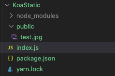

这篇文章继续前面的`Koa`源码系列，这个系列已经有两篇文章了：

1. 第一篇讲解了`Koa`的核心架构和源码：[手写Koa.js源码](https://juejin.cn/post/6892952604163342344)
2. 第二篇讲解了`@koa/router`的架构和源码：[手写@koa/router源码](https://juejin.cn/post/6895594434843869197)

本文会接着讲一个常用的中间件----`koa-static`，这个中间件是用来搭建静态服务器的。

其实在我之前[使用Node.js原生API写一个web服务器](https://juejin.cn/post/6887797543212843016)已经讲过怎么返回一个静态文件了，代码虽然比较丑，基本流程还是差不多的：

1. 通过请求路径取出正确的文件地址
2. 通过地址获取对应的文件
3. 使用`Node.js`的API返回对应的文件，并设置相应的`header`

`koa-static`的代码更通用，更优雅，但是基本思路还是一样的，下面我们来看看他是怎么做的吧。本文还是采用一贯套路，先看一下他的基本用法，然后从基本用法入手去读源码，并手写一个简化版的源码来替换他。

## 基本用法

`koa-static`使用很简单，主要代码就一行：

```javascript
const Koa = require('koa');
const serve = require('koa-static');

const app = new Koa();

// 主要就是这行代码
app.use(serve('public'));

app.listen(3001, () => {
    console.log('listening on port 3001');
});
```

上述代码中的`serve`就是`koa-static`，他运行后会返回一个`Koa`中间件，然后`Koa`的实例直接引用这个中间件就行了。

`serve`方法支持两个参数，第一个是静态文件的目录，第二个参数是一些配置项，可以不传。像上面的代码`serve('public')`就表示`public`文件夹下面的文件都可以被外部访问。比如我在里面放了一张图片:



跑起来就是这样子：


注意上面这个路径请求的是`/test.jpg`，前面并没有`public`，说明`koa-static`对请求路径进行了判断，发现是文件就映射到服务器的`public`目录下面，这样可以防止外部使用者探知服务器目录结构。

## 手写源码

### 返回的是一个`Koa`中间件

我们看到`koa-static`导出的是一个方法`serve`，这个方法运行后返回的应该是一个`Koa`中间件，这样`Koa`才能引用他，所以我们先来写一下这个结构吧：

```javascript
module.exports = serve;   // 导出的是serve方法

// serve接受两个参数
// 第一个参数是路径地址
// 第二个是配置选项
function serve(root, opts) {
    // 返回一个方法，这个方法符合koa中间件的定义
    return async function serve(ctx, next) {
        await next();
    }
}
```

### 调用`koa-send`返回文件

现在这个中间件是空的，其实他应该做的是将文件返回，返回文件的功能也被单独抽取出来成了一个库----`koa-send`，我们后面会看他源码，这里先直接用吧。

```javascript
function serve(root, opts) {
    // 这行代码如果效果就是
    // 如果没传opts，opts就是空对象{}
    // 同时将它的原型置为null
    opts = Object.assign(Object.create(null), opts);

    // 将root解析为一个合法路径，并放到opts上去
    // 因为koa-send接收的路径是在opts上
    opts.root = resolve(root);
  
  	// 这个是用来兼容文件夹的，如果请求路径是一个文件夹，默认去取index
    // 如果用户没有配置index，默认index就是index.html
    if (opts.index !== false) opts.index = opts.index || 'index.html';

  	// 整个serve方法的返回值是一个koa中间件
  	// 符合koa中间件的范式： (ctx, next) => {}
    return async function serve(ctx, next) {
        let done = false;    // 这个变量标记文件是否成功返回

        // 只有HEAD和GET请求才响应
        if (ctx.method === 'HEAD' || ctx.method === 'GET') {
            try {
                // 调用koa-send发送文件
                // 如果发送成功，koa-send会返回路径，赋值给done
                // done转换为bool值就是true
                done = await send(ctx, ctx.path, opts);
            } catch (err) {
                // 如果不是404，可能是一些400，500这种非预期的错误，将它抛出去
                if (err.status !== 404) {
                    throw err
                }
            }
        }

        // 通过done来检测文件是否发送成功
        // 如果没成功，就让后续中间件继续处理他
        // 如果成功了，本次请求就到此为止了
        if (!done) {
            await next()
        }
    }
}
```

### opt.defer

`defer`是配置选项`opt`里面的一个可选参数，他稍微特殊一点，默认为`false`，如果你传了`true`，`koa-static`会让其他中间件先响应，即使其他中间件写在`koa-static`后面也会让他先响应，自己最后响应。要实现这个，其实就是控制调用`next()`的时机。在[讲Koa源码的文章里面已经讲过了](https://juejin.cn/post/6892952604163342344)，调用`next()`其实就是在调用后面的中间件，所以像上面代码那样最后调用`next()`，就是先执行`koa-static`然后再执行其他中间件。如果你给`defer`传了`true`，其实就是先执行`next()`，然后再执行`koa-static`的逻辑，按照这个思路我们来支持下`defer`吧：

```javascript
function serve(root, opts) {
    opts = Object.assign(Object.create(null), opts);

    opts.root = resolve(root);

    // 如果defer为false，就用之前的逻辑，最后调用next
    if (!opts.defer) {
        return async function serve(ctx, next) {
            let done = false;    

            if (ctx.method === 'HEAD' || ctx.method === 'GET') {
                try {
                    done = await send(ctx, ctx.path, opts);
                } catch (err) {
                    if (err.status !== 404) {
                        throw err
                    }
                }
            }

            if (!done) {
                await next()
            }
        }
    }

    // 如果defer为true，先调用next，然后执行自己的逻辑
    return async function serve(ctx, next) {
        // 先调用next,执行后面的中间件
        await next();

        if (ctx.method !== 'HEAD' && ctx.method !== 'GET') return

        // 如果ctx.body有值了，或者status不是404，说明请求已经被其他中间件处理过了，就直接返回了
        if (ctx.body != null || ctx.status !== 404) return // eslint-disable-line

        // koa-static自己的逻辑还是一样的，都是调用koa-send
        try {
            await send(ctx, ctx.path, opts)
        } catch (err) {
            if (err.status !== 404) {
                throw err
            }
        }
    }
}
```

`koa-static`源码总共就几十行：[https://github.com/koajs/static/blob/master/index.js](https://github.com/koajs/static/blob/master/index.js)

### koa-send

上面我们看到`koa-static`其实是包装的`koa-send`，真正发送文件的操作都是在`koa-send`里面的。文章最开头说的几件事情`koa-static`一件也没干，都丢给`koa-send`了，也就是说他应该把这几件事都干完：

1. 通过请求路径取出正确的文件地址
2. 通过地址获取对应的文件
3. 使用`Node.js`的API返回对应的文件，并设置相应的`header`

由于`koa-send`代码也不多，我就直接在代码中写注释了，通过前面的使用，我们已经知道他的使用形式是：

```javascript
send (ctx, path, opts)
```

他接收三个参数：

1. `ctx`：就是`koa`的那个上下文`ctx`。
2. `path`：`koa-static`传过来的是`ctx.path`，看过`koa`源码解析的应该知道，这个值其实就是`req.path`
3. `opts`: 一些配置项，`defer`前面讲过了，会影响执行顺序，其他还有些缓存控制什么的。

下面直接来写一个`send`方法吧：

```javascript
const fs = require('fs')
const fsPromises = fs.promises;
const { stat, access } = fsPromises;

const {
    normalize,
    basename,
    extname,
    resolve,
    parse,
    sep
} = require('path')
const resolvePath = require('resolve-path')

// 导出send方法
module.exports = send;

// send方法的实现
async function send(ctx, path, opts = {}) {
    // 先解析配置项
    const root = opts.root ? normalize(resolve(opts.root)) : '';  // 这里的root就是我们配置的静态文件目录，比如public
    const index = opts.index;    // 请求文件夹时，会去读取这个index文件
    const maxage = opts.maxage || opts.maxAge || 0;     // 就是http缓存控制Cache-Control的那个maxage
    const immutable = opts.immutable || false;   // 也是Cache-Control缓存控制的
    const format = opts.format !== false;   // format默认是true，用来支持/directory这种不带/的文件夹请求

    const trailingSlash = path[path.length - 1] === '/';    // 看看path结尾是不是/
    path = path.substr(parse(path).root.length)             // 去掉path开头的/

    path = decode(path);      // 其实就是decodeURIComponent， decode辅助方法在后面
    if (path === -1) return ctx.throw(400, 'failed to decode');

    // 如果请求以/结尾，肯定是一个文件夹，将path改为文件夹下面的默认文件
    if (index && trailingSlash) path += index;

    // resolvePath可以将一个根路径和请求的相对路径合并成一个绝对路径
    // 并且防止一些常见的攻击，比如GET /../file.js
    // GitHub地址：https://github.com/pillarjs/resolve-path
    path = resolvePath(root, path)

    // 用fs.stat获取文件的基本信息，顺便检测下文件存在不
    let stats;
    try {
        stats = await stat(path)

        // 如果是文件夹，并且format为true，拼上index文件
        if (stats.isDirectory()) {
            if (format && index) {
                path += `/${index}`
                stats = await stat(path)
            } else {
                return
            }
        }
    } catch (err) {
        // 错误处理，如果是文件不存在，返回404，否则返回500
        const notfound = ['ENOENT', 'ENAMETOOLONG', 'ENOTDIR']
        if (notfound.includes(err.code)) {
          	// createError来自http-errors库，可以快速创建HTTP错误对象
            // github地址：https://github.com/jshttp/http-errors
            throw createError(404, err)
        }
        err.status = 500
        throw err
    }

    // 设置Content-Length的header
    ctx.set('Content-Length', stats.size)

    // 设置缓存控制header
    if (!ctx.response.get('Last-Modified')) ctx.set('Last-Modified', stats.mtime.toUTCString())
    if (!ctx.response.get('Cache-Control')) {
        const directives = [`max-age=${(maxage / 1000 | 0)}`]
        if (immutable) {
            directives.push('immutable')
        }
        ctx.set('Cache-Control', directives.join(','))
    }

    // 设置返回类型和返回内容
   if (!ctx.type) ctx.type = extname(path)
    ctx.body = fs.createReadStream(path)

    return path
}

function decode(path) {
    try {
        return decodeURIComponent(path)
    } catch (err) {
        return -1
    }
}
```

上述代码并没有太复杂的逻辑，先拼一个完整的地址，然后使用`fs.stat`获取文件的基本信息，如果文件不存在，这个API就报错了，直接返回`404`。如果文件存在，就用`fs.stat`拿到的信息设置`Content-Length`和一些缓存控制的header。

`koa-send`的源码也只有一个文件，百来行代码:[https://github.com/koajs/send/blob/master/index.js](https://github.com/koajs/send/blob/master/index.js)

### ctx.type和ctx.body

上述代码我们看到最后并没有直接返回文件，而只是设置了`ctx.type`和`ctx.body`这两个值就结束了，为啥设置了这两个值，文件就自动返回了呢？要知道这个原理，我们要结合`Koa`源码来看。

之前讲`Koa`源码的时候我提到过，他扩展了`Node`原生的`res`，并且在里面给`type`属性添加了一个`set`方法：

```javascript
set type(type) {
  type = getType(type);
  if (type) {
    this.set('Content-Type', type);
  } else {
    this.remove('Content-Type');
  }
}
```

这段代码的作用是当你给`ctx.type`设置值的时候，会自动给`Content-Type`设置值，`getType`其实是另一个第三方库[`cache-content-type`](https://github.com/node-modules/cache-content-type)，他可以根据你传入的文件类型，返回匹配的`MIME type`。我刚看`koa-static`源码时，找了半天也没找到在哪里设置的`Content-Type`，后面发现是在`Koa`源码里面。**所以设置了`ctx.type`其实就是设置了`Content-Type`**。

`koa`扩展的`type`属性看这里：[https://github.com/koajs/koa/blob/master/lib/response.js#L308](https://github.com/koajs/koa/blob/master/lib/response.js#L308)

之前讲`Koa`源码的时候我还提到过，当所有中间件都运行完了，最后会运行一个方法`respond`来返回结果，在那篇文章里面，`respond`是简化版的，直接用`res.end`返回了结果：

```javascript
function respond(ctx) {
  const res = ctx.res; // 取出res对象
  const body = ctx.body; // 取出body

  return res.end(body); // 用res返回body
}
```

直接用`res.end`返回结果只能对一些简单对象有效，比如字符串什么的。对于复杂对象，比如文件，这个就不行了。那要怎么处理呢？回到`koa-send`源码里面，我们给`ctx.body`设置的值其实是一个可读流:

```javascript
ctx.body = fs.createReadStream(path)
```

这种流怎么返回呢？其实`Node.js`对于返回流本身就有很好的支持。要返回一个值，需要用到`http`回调函数里面的`res`，这个`res`本身其实也是一个流。[大家可以再翻翻`Node.js`官方文档](http://nodejs.cn/api/http.html#http_class_http_serverresponse)，这里的`res`其实是`http.ServerResponse`类的一个实例，而`http.ServerResponse`本身又继承自`Stream`类：


**所以`res`本身就是一个流`Stream`，那`Stream`的API就可以用了**。`ctx.body`是使用`fs.createReadStream`创建的，所以他是一个可读流，[可读流有一个很方便的API可以直接让内容流动到可写流：`readable.pipe`](http://nodejs.cn/api/stream.html#stream_readable_pipe_destination_options)，使用这个API，`Node.js`会自动将可读流里面的内容推送到可写流，数据流会被自动管理，所以即使可读流更快，目标可写流也不会超负荷。所以我们在`Koa`的`respond`里面支持下流式`body`就行了:

```javascript
function respond(ctx) {
  const res = ctx.res; 
  const body = ctx.body; 
  
  // 如果body是个流，直接用pipe将它绑定到res上
  if (body instanceof Stream) return body.pipe(res);

  return res.end(body); 
}
```

`Koa`源码对于流的处理看这里：[https://github.com/koajs/koa/blob/master/lib/application.js#L267](https://github.com/koajs/koa/blob/master/lib/application.js#L267)

## 总结

现在，我们可以用自己写的`koa-static`来替换官方的了，运行效果是一样的。最后我们再来回顾下本文的要点：

1. 本文是`Koa`常用静态服务中间件`koa-static`的源码解析。

2. 由于是一个`Koa`的中间件，所以`koa-static`的返回值是一个方法，而且需要符合中间件范式: `(ctx, next) => {}`

3. 作为一个静态服务中间件，`koa-static`本应该完成以下几件事情：

   1. 通过请求路径取出正确的文件地址
   2. 通过地址获取对应的文件
   3. 使用`Node.js`的API返回对应的文件，并设置相应的`header`

   但是这几件事情他一件也没干，都扔给`koa-send`了，所以他官方文档也说了他只是`wrapper for koa-send.`

4. 作为一个`wrapper`他还支持了一个比较特殊的配置项`opt.defer`，这个配置项可以控制他在所有`Koa`中间件里面的执行时机，其实就是调用`next`的时机。如果你给这个参数传了`true`，他就先调用`next`，让其他中间件先执行，自己最后执行，反之亦然。有了这个参数，你可以将`/test.jpg`这种请求先作为普通路由处理，路由没匹配上再尝试静态文件，这在某些场景下很有用。

5. `koa-send`才是真正处理静态文件，他把前面说的三件事全干了，在拼接文件路径时还使用了`resolvePath`来防御常见攻击。

6. `koa-send`取文件时使用了`fs`模块的API创建了一个可读流，并将它赋值给`ctx.body`，同时设置了`ctx.type`。

7. 通过`ctx.type`和`ctx.body`返回给请求者并不是`koa-send`的功能，而是`Koa`本身的功能。由于`http`模块提供和的`res`本身就是一个流，所以我们可以通过可读流的`pipe`函数直接将`ctx.body`绑定到`res`上，剩下的工作`Node.js`会自动帮我们完成。

## 参考资料：

`koa-static`文档：[https://github.com/koajs/static](https://github.com/koajs/static)

`koa-static`源码：[https://github.com/koajs/static/blob/master/index.js](https://github.com/koajs/static/blob/master/index.js)

`koa-send`文档：[https://github.com/koajs/send](https://github.com/koajs/send)

`koa-send`源码：[https://github.com/koajs/send/blob/master/index.js](https://github.com/koajs/send/blob/master/index.js)

**文章的最后，感谢你花费宝贵的时间阅读本文，如果本文给了你一点点帮助或者启发，请不要吝啬你的赞和GitHub小星星，你的支持是作者持续创作的动力。**

**作者博文GitHub项目地址： [https://github.com/dennis-jiang/Front-End-Knowledges](https://github.com/dennis-jiang/Front-End-Knowledges)**

**作者掘金文章汇总：[https://juejin.im/post/5e3ffc85518825494e2772fd](https://juejin.im/post/5e3ffc85518825494e2772fd)**

**我也搞了个公众号[进击的大前端]，不打广告，不写水文，只发高质量原创，欢迎关注~**