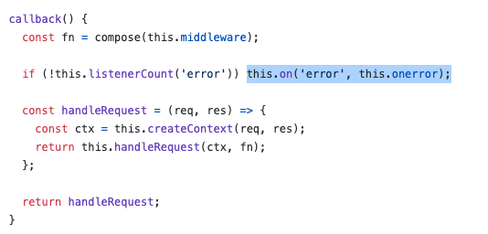

用`Node.js`写一个`web服务器`，我前面已经写过两篇文章了：

* 第一篇是不使用任何框架也能搭建一个`web服务器`，主要是熟悉`Node.js`原生API的使用：[使用Node.js原生API写一个web服务器](https://juejin.im/post/6887797543212843016)
* 第二篇文章是看了`Express`的基本用法，更主要的是看了下他的源码：

`Express`的源码还是比较复杂的，自带了路由处理和静态资源支持等等功能，功能比较全面。与之相比，本文要讲的`koa`就简洁多了，`koa`虽然是`Express`的原班人马写的，但是设计思路却不一样。`Express`更多是偏向`All in one`的思想，各种功能都集成在一起，而`koa`本身的库只有一个中间件内核，其他像路由处理和静态资源这些功能都没有，全部需要引入第三方中间件库才能实现。下面这张图可以直观的看到`Express`和`koa`在功能上的区别，[此图来自于官方文档](https://github.com/koajs/koa/blob/master/docs/koa-vs-express.md)：


基于`koa`的这种架构，我计划会分几篇文章来写，全部都是源码解析：

* `koa`的核心架构会写一篇文章，也就是本文。
* 对于一个`web服务器`来说，路由是必不可少的，所以`@koa/router`会写一篇文章。
* 另外可能会写一些常用中间件，静态文件支持或者`bodyparser`等等，具体还没定，可能会有一篇或多篇文章。

## 简单示例

我写源码解析，一般都遵循一个简单的套路：先引入库，写一个简单的例子，然后自己手写源码来替代这个库，并让我们的例子顺利运行。本文也是遵循这个套路，由于`koa`的核心库只有中间件，所以我们写出的例子也比较简单，也只有中间件。

### Hello World

第一个例子是`Hello World`，随便请求一个路径都返回`Hello World`。

```javascript
const Koa = require("koa");
const app = new Koa();

app.use((ctx) => {
  ctx.res.end("Hello World");
});

const port = 3001;
app.listen(port, () => {
  console.log(`Server is running on http://127.0.0.1:${port}/`);
});
```

### logger

然后再来一个`logger`吧，就是记录下处理当前请求花了多长时间：

```javascript
app.use(async (ctx, next) => {
  const start = Date.now();
  await next();
  const ms = Date.now() - start;
  console.log(`${ctx.method} ${ctx.url} - ${ms}ms`);
});
```

注意这个中间件应该放到`Hello World`的前面。

从上面两个例子的代码来看，`koa`跟`express`有几个明显的区别：

* `ctx`替代了`req`和`res`
* 可以使用JS的新API了，比如`async`和`await`

## 手写源码

手写源码前我们看看用到了哪些API，这些就是我们手写的目标：

* **new Koa()**：首先肯定是`Koa`这个类了，因为他使用`new`进行实例化，所以我们认为他是一个类。
* **app.use**：**app**是`Koa`的一个实例，`app.use`看起来是一个添加中间件的实例方法。
* **app.listen**：启动服务器的实例方法
* **ctx**：这个是`Koa`的上下文，看起来替代了以前的`req`和`res`
* **async**和**await**：支持新的语法，而且能使用`await next()`，说明`next()`返回的是一个`promise`。

本文的手写源码全部参照官方源码写成，文件名和函数名尽量保持一致，写到具体的方法时我也会贴上官方源码地址。`Koa`这个库代码并不多，主要都在这个文件夹里面：[https://github.com/koajs/koa/tree/master/lib](https://github.com/koajs/koa/tree/master/lib)，下面我们开始吧。

### Koa类

从`Koa`项目的`package.json`里面的`main`这行代码可以看出，整个应用的入口是`lib/application.js`这个文件：

```javascript
"main": "lib/application.js",
```

`lib/application.js`这个文件就是我们经常用的`Koa`类，虽然我们经常叫他`Koa`类，但是在源码里面这个类叫做`Application`。我们先来写一下这个类的壳吧：

```javascript
// application.js

const Emitter = require("events");

// module.exports 直接导出Application类
module.exports = class Application extends Emitter {
  // 构造函数先运行下父类的构造函数
  // 再进行一些初始化工作
  constructor() {
    super();

    // middleware实例属性实例化为一个空数组，用来存储后续可能的中间件
    this.middleware = [];
  }
};
```

这段代码我们可以看出，`Koa`直接使用`class`关键之来申明类了，看过我之前`Express`源码解析的朋友可能还有印象，`Express`源码里面还是使用的老的`prototype`来实现面向对象的。所以`Koa`项目介绍里面的`Expressive middleware for node.js using ES2017 async functions`并不是一句虚言，它不仅支持`ES2017`新的API，而且在自己的源码里面里面也是用的新API。我想这也是`Koa`要求运行环境必须是`node v7.6.0 or higher`的原因吧。**所以到这里我们其实已经可以看出`Koa`和`Express`的一个重大区别了，那就是：`Express`使用来的API，兼容性更强，可以在老的`Node.js`版本上运行；`Koa`因为使用了新API，只能在`v7.6.0`或者更高版本上运行了。**

这段代码还有个点需要注意，那就是`Application`继承自`Node.js`原生的`EventEmitter`类，这个类其实就是一个发布订阅模式，可以订阅和发布消息，[我在另一篇文章里面详细讲过他的源码](https://juejin.im/post/6844904101331877895)。所以他有些方法如果在`application.js`里面找不到，那可能就是继承自`EventEmitter`，比如下图这行代码：



这里有`this.on`这个方法，看起来他应该是`Application`的一个实例方法，但是这个文件里面没有，其实他就是继承自`EventEmitter`，是用来给`error`这个事件添加回调函数的。这行代码`if`里面的`this.listenerCount`也是`EventEmitter`的一个实例方法。

`Application`类完全是JS面向对象的运用，如果你对JS面向对象还不是很熟悉，可以先看看这篇文章：[https://juejin.im/post/6844904069887164423](https://juejin.im/post/6844904069887164423)。

### app.use

从我们前面的使用示例可以看出`app.use`的作用就是添加一个中间件，我们在构造函数里面也初始化了一个变量`middleware`，用来存储中间件，所以`app.use`的代码就很简单了，将接收到的中间件塞到这个数组就行：

```javascript
use(fn) {
  // 中间件必须是一个函数，不然就报错
  if (typeof fn !== "function")
    throw new TypeError("middleware must be a function!");

  // 处理逻辑很简单，将接收到的中间件塞入到middleware数组就行
  this.middleware.push(fn);
  return this;
}
```

注意`app.use`方法最后返回了`this`，这个有点意思，为什么要返回`this`呢，这么做了有什么效果呢？[这个其实我之前在其他文章讲过的](https://juejin.im/post/6844904084571439118#heading-7)：类的实例方法返回`this`可以实现链式调用。比如这里的`app.use`就可以连续点点点了，像这样：

```javascript
app.use(middlewaer1).use(middlewaer2).use(middlewaer3)
```

为什么会有这种效果呢？因为这里的`this`其实就是当前实例，其实就是`app`，所以`app.use()`的返回值就是`app`，`app`上有个实例方法`use`，所以可以继续点`app.use().use()`。

`app.use`的官方源码看这里: [https://github.com/koajs/koa/blob/master/lib/application.js#L122](https://github.com/koajs/koa/blob/master/lib/application.js#L122)

### app.listen

在前面的示例中，`app.listen`的作用是用来启动服务器，看过前面用原生API实现`web服务器`的朋友都知道，要启动服务器需要调用原生的`http.createServer`，所以这个方法就是用来调用`http.createServer`的。

```javascript
listen(...args) {
  const server = http.createServer(this.callback());
  return server.listen(...args);
}
```

这个方法本身其实没有太多可说的，只是调用`http`模块启动服务而已，主要的逻辑都在`this.callback()`里面了。

`app.listen`的官方源码看这里：[https://github.com/koajs/koa/blob/master/lib/application.js#L79](https://github.com/koajs/koa/blob/master/lib/application.js#L79)

### app.callback

`this.callback()`是传给`http.createServer`的回调函数，也是一个实例函数，这个函数必须符合`http.createServer`的参数形式，也就是

```javascript
http.createServer(function(req, res){})
```

所以`this.callback()`的返回值必须是一个函数，而且是这种形式`function(req, res){}`。

除了形式必须符合外，`this.callback()`具体要干什么呢？他是`http`模块的回调函数，所以他必须处理所有的网络请求，所有处理逻辑都必须在这个方法里面。但是`Koa`的处理逻辑是以中间件的形式存在的，对于一个请求来说，他必须一个一个的穿过所有的中间件，具体穿过的逻辑，你当然可以遍历`middleware`这个数组，将里面的方法一个一个拿出来处理，当然也可以用业界更常用的方法：`compose`。

`compose`一般来说就是将一系列方法合并成一个方法来方便调用，具体实现的形式并不是固定的，有[面试种常见的用`reduce`实现的`compose`](https://juejin.im/post/6844904061821517832)，也有像`Koa`这样根据自己需求单独实现的`compose`。`Koa`的`compose`也单独封装了一个库`koa-compose`，这个库源码也是我们必须要看的，我们一步一步来，先把`this.callback`写出来吧。

```javascript
callback() {
  // compose来自koa-compose库，就是将中间件合并成一个函数
  // 我们需要自己实现
  const fn = compose(this.middleware);

  // callback返回值必须符合http.createServer参数形式
  // 即 (req, res) => {}
  const handleRequest = (req, res) => {
    const ctx = this.createContext(req, res);
    return this.handleRequest(ctx, fn);
  };

  return handleRequest;
}
```

这个方法先用`koa-compose`将中间件都合成了一个函数`fn`，然后在`http.createServer`的回调里面使用`req`和`res`创建了一个`Koa`常用的上下文`ctx`，然后再调用`this.handleRequest`来真正处理网络请求。注意这里的`this.handleRequest`是个实例方法，和当前方法里面的局部变量`handleRequest`并不是一个东西。这几个方法我们一个一个来看下。

`this.callback`对应的官方源码看这里：[https://github.com/koajs/koa/blob/master/lib/application.js#L143](https://github.com/koajs/koa/blob/master/lib/application.js#L143)

### app.createContext

上面用到的`this.createContext`也是一个实例方法，也就是`app.createContext`。这个方法根据`http.createServer`传入的`req`和`res`来构建`ctx`这个上下文，官方源码长这样：


这段代码里面`context`，`ctx`，`response`，`res`，`request`，`req`，`app`这几个变量相互赋值，头都看晕了。其实完全没必要陷入这堆面条里面去，我们只需要将他的思路和骨架拎清楚就行，那怎么来拎呢？

1. 首先搞清楚他这么赋值的目的，他的目的其实很简单，就是为了使用方便。通过任何一个变量都可以拿到其他变量，比如我现在只有`request`，但是我想要的是`req`，怎么办呢？通过这种赋值后，直接用`request.req`就行。其他的类似，这种面条式的赋值我很难说好还是不好，但是使用时确实很方便，缺点就是看源码时容易陷进去。
2. 那`request`和`req`有啥区别？这两个变量长得这么像，到底是干啥的？这就要说到`Koa`对于原生`req`的扩展，我们知道`http.createServer`的回调里面会传入`req`作为请求对象的描述，里面可以拿到请求的`header`啊，`method`啊这些变量。但是`Koa`觉得这个`req`提供的API不好用，所以他在这个基础上扩展了一些API，其实就是一些语法糖，扩展后的`req`就变成了`request`。之所以扩展后还保留的原始的`req`，应该也是想为用户提供和更多选择吧。**所以这两个变量的区别就是`request`是`Koa`包装过的`req`，`req`是原生的请求对象。`response`和`res`也是类似的。**
3. 既然`request`和`response`都只是包装过的语法糖，那其实`Koa`没有这两个变量也能跑起来。所以我们拎骨架的时候完全可以将这两个变量踢出去，这下骨架就清晰了。

那我们踢出`response`和`request`后再来写下`createContext`这个方法：

```javascript
// 创建上下文ctx对象的函数
createContext(req, res) {
  const context = Object.create(this.context);
  context.app = this;
  context.req = req;
  context.res = res;

  return context;
}
```

这下整个世界感觉都清爽了，`context`上的东西也一目了然了。但是我们的`context`最初是来自`this.context`的，这个变量还必须看下。

`app.createContext`对应的官方源码看这里：[https://github.com/koajs/koa/blob/master/lib/application.js#L177](https://github.com/koajs/koa/blob/master/lib/application.js#L177)

### context.js

上面的`this.context`其实就是来自`context.js`，所以我们先在`Application`构造函数里面添加这个变量：

```javascript
// application.js

const context = require("./context");

// 构造函数里面
constructor() {
	// 省略其他代码
  this.context = context;
}
```

然后再来看看`context.js`里面有啥，`context.js`的结构大概是这个样子：

```javascript
const delegate = require("delegates");

module.exports = {
  inspect() {},
  toJSON() {},
  throw() {},
  onerror() {},
};

const proto = module.exports;

delegate(proto, "response")
  .method("set")
  .method("append")
  .access("message")
  .access("body");

delegate(proto, "request")
  .method("acceptsLanguages")
  .method("accepts")
  .access("querystring")
  .access("socket");
```

这段代码里面`context`导出的是一个对象`proto`，这个对象本身有一些方法，`inspect`，`toJSON`之类的。然后还有一堆`delegate().method()`，`delegate().access()`之类的。嗯，这个是干啥的呢？要知道这个的作用，我们需要去看`delegates`这个库：[https://github.com/tj/node-delegates](https://github.com/tj/node-delegates)，这个库也是`tj`的。一般使用是这样的：

```javascript
delegate(proto, target).method("set");
```

这行代码的作用是，当你调用`proto.set()`方法时，其实是转发给了`proto[target]`，实际调用的是`proto[target].set()`。所以就是`proto`代理了对`target`的访问。

那用在我们`context.js`里面是啥意思呢？比如这行代码：

```javascript
delegate(proto, "response")
  .method("set");
```

这行代码的作用是，当你调用`proto.set()`时，实际去调用`proto.response.set()`，将`proto`换成`ctx`就是：**当你调用`ctx.set()`时，实际调用的是`ctx.response.set()`**。这么做的目的其实也是为了使用方便，可以少写一个`response`。而且`ctx`不仅仅代理`response`，还代理了`request`，所以你还可以通过`ctx.accepts()`这样来调用到`ctx.request.accepts()`。一个`ctx`就囊括了`response`和`request`，所以这里的`context`也是一个语法糖。因为我们前面已经踢了`response`和`request`这两个语法糖，`context`作为包装了这两个语法糖的语法糖，我们也一起踢掉吧。在`Application`的构造函数里面直接将`this.context`赋值为空对象：

```javascript
// application.js
constructor() {
	// 省略其他代码
  this.context = {};
}
```

现在语法糖都踢掉了，整个`Koa`的结构就更清晰了，`ctx`上面也只有几个必须的变量：

```javascript
ctx = {
  app: this,
  req,
  res
}
```


### koa-compose

`koa-compose`虽然被作为了一个单独的库，但是他的作用却很关键，所以我们也来看看他的源码吧。